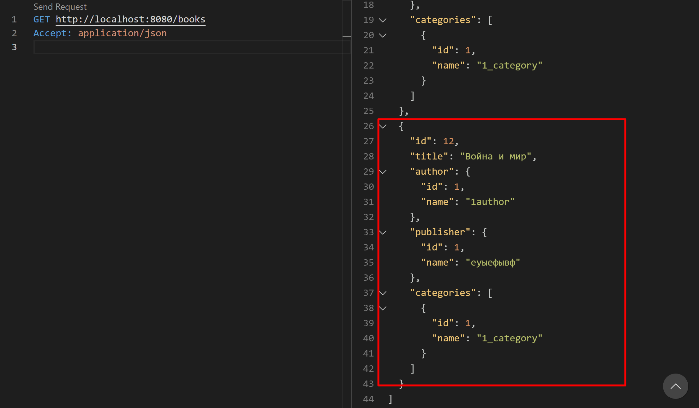

# Лабораторная работа 3
Выполнено студентом: Gachayev Dmitrii I2302

Работа представляет собой Spring Boot приложение для управления библиотекой. Приложение поддерживает CRUD-операции с использованием REST API и взаимодействует с базой данных через `JDBC`. API работает с DTO-объектами, а не напрямую с entities.

---

## Описание приложения

Приложение реализовано согласно следующим условиям и содержит:

- **3 контроллера**
- **3 сервиса**
- **5 взаимосвязанных сущностей** (Author, Publisher, Book, Category, Library)

---

## Структура и взаимосвязи сущностей:

- **Author**
    - Один автор может написать несколько книг (One-to-Many с Book).

- **Publisher**
    - Один издатель может издать несколько книг (One-to-Many с Book).

- **Book**
    - Каждая книга принадлежит одному автору (Many-to-One с Author).
    - Каждая книга имеет одного издателя (Many-to-One с Publisher).
    - Каждая книга может принадлежать нескольким категориям (Many-to-Many с Category).

- **Category**
    - Одна категория может содержать несколько книг (Many-to-Many с Book).

- **Library (Библиотека)**
    - Содержит коллекцию книг (ElementCollection).

---
## Тестирование CRUD функционала:
Books:
- CREATE:
```
POST http://localhost:8080/books
Content-Type: application/json

{
  "title": "Война и мир",
  "authorId": 1,
  "publisherId": 1,
  "categoryIds": [1],
  "libraryIds": [1]
}
```
Выполняется и добавляет книгу в бд. Для добавления книги все поля уже должны существовать (нельзя создать книгу с несуществующим автором и тп)

