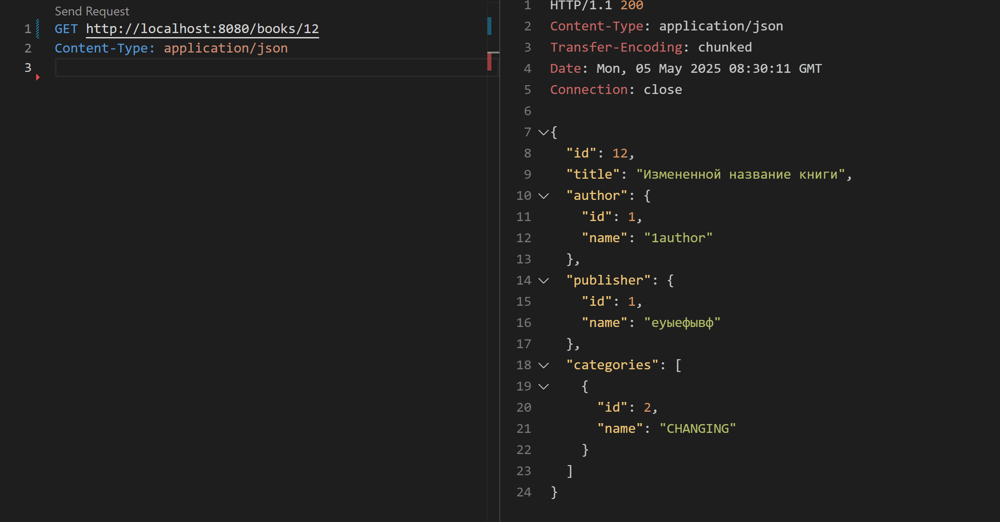
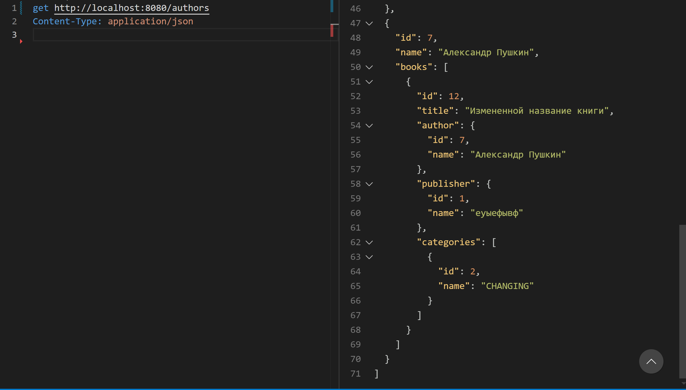
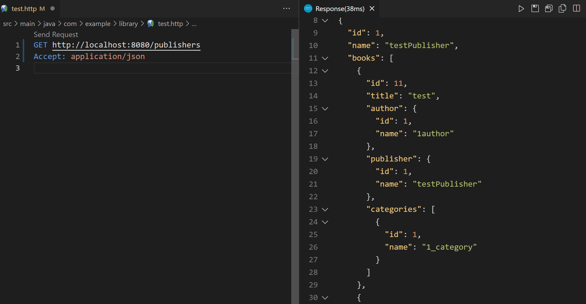
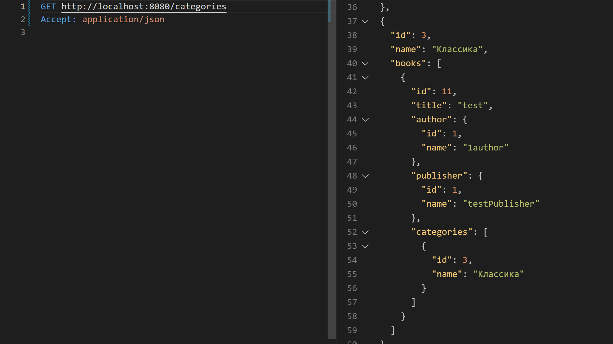

# Лабораторная работа 3
Выполнено студентом: Gachayev Dmitrii I2302

Работа представляет собой Spring Boot приложение для управления библиотекой. Приложение поддерживает CRUD-операции с использованием REST API и взаимодействует с базой данных через `JDBC`. API работает с DTO-объектами, а не напрямую с entities.

---

## Описание приложения

Приложение реализовано согласно следующим условиям и содержит:

- **3 контроллера**
- **3 сервиса**
- **5 взаимосвязанных сущностей** (Author, Publisher, Book, Category, Library)

---

## Структура и взаимосвязи сущностей:

- **Author**
    - Один автор может написать несколько книг (One-to-Many с Book).

- **Publisher**
    - Один издатель может издать несколько книг (One-to-Many с Book).

- **Book**
    - Каждая книга принадлежит одному автору (Many-to-One с Author).
    - Каждая книга имеет одного издателя (Many-to-One с Publisher).
    - Каждая книга может принадлежать нескольким категориям (Many-to-Many с Category).

- **Category**
    - Одна категория может содержать несколько книг (Many-to-Many с Book).

- **Library (Библиотека)**
    - Содержит коллекцию книг (ElementCollection).

---
## Тестирование CRUD функционала:
Любой запрос возвращает также всю информацию о связанных сущностях, например при GET к книге возвращается id, name автора паблишера и категорий

### Books:
- CREATE:
```
POST http://localhost:8080/books
Content-Type: application/json

{
  "title": "Война и мир",
  "authorId": 1,
  "publisherId": 1,
  "categoryIds": [1],
  "libraryIds": [1]
}
```
Выполняется и добавляет книгу в бд. Для добавления книги все поля уже должны существовать (нельзя создать книгу с несуществующим автором и тп)

- READ:
```
GET http://localhost:8080/books
Accept: application/json
```
Возвращает список всех книг, на скриншоте можно увидеть добавленную раннее книгу


- UPDATE:
```commandline
PUT http://localhost:8080/books/12
Content-Type: application/json

{
  "title": "Измененной название книги",
  "authorId": 1,
  "publisherId": 1,
  "categoryIds": [2],
  "libraryIds": [1]
}
```

Изменения на скриншоте:



- DELETE:
```commandline
DELETE http://localhost:8080/books/1
```
### Authors:
- CREATE:
```commandline
POST http://localhost:8080/authors
Content-Type: application/json

{
  "name": "Александр Пушкин",
  "book": "12"
}
```

- READ:
```commandline
get http://localhost:8080/authors
Content-Type: application/json
```
Автора с прошлого запроса можно увидеть на скриншоте:


- UPDATE:
```commandline
PUT http://localhost:8080/books/1
Content-Type: application/json

{
  "name": "new book"
}
```
- DELETE:
```commandline
DELETE http://localhost:8080/authors/6
```
### Publisher:
- CREATE:
```commandline
POST http://localhost:8080/publishers
Content-Type: application/json

{
  "name": "testPublisher",
  "book": "11"
}
```

- READ:
```commandline
GET http://localhost:8080/publishers
Accept: application/json
```
Издателя с прошлого запроса можно увидеть на скриншоте:



- UPDATE:
```commandline
PUT http://localhost:8080/publishers/2
Content-Type: application/json

{
  "name": "CHANGED NAME"
}
```

- DELETE:
```commandline
DELETE http://localhost:8080/publishers/3
```
### Category:
- CREATE:
```commandline
POST http://localhost:8080/categories
Content-Type: application/json

{
  "name": "Классика",
  "book": 11
}
```
- READ:
```
GET http://localhost:8080/categories
Accept: application/json
```

Категорию с прошлого запроса можно увидеть на скриншоте:



- UPDATE:
```
PUT  http://localhost:8080/categories/3
Content-Type: application/json

{
  "name": "Хоррор"
}

```

- DELETE:
```commandline
DELETE http://localhost:8080/categories/1
```